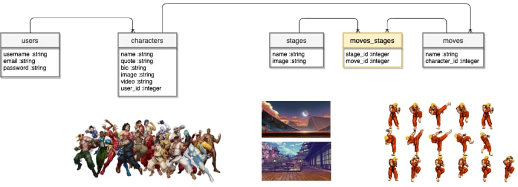

# Sinatra::Street Fighter

<div align="center">
  
</div>

<br>

<strong>Domain Modeling :: Street Fighter</strong><br>
Welcome to your Space Exploration, where you can select your space crew, pick your favorite spacecraft (powered by SpaceX), and infinite amount of planets in Milky Way Galaxy to travel to!<br>

<p><a href="https://youtu.be/pvurDvp8TZY">YouTube Demo</a></p>
<p><a href="https://dev.to/codinghall/sinatra-x-street-fighter-1hgl">DEV Blog</a></p>


## About

<p>In my Street Fighter domain modeling universe, the Minimum Viable Product (MVP) I was aiming for this capstone project would be to allow a user to select a character and perform character's fighting moves on multiple stage platforms.</p>
<p>The extended function I am aiming for would be to save a user's session when signing up or logging in, and user's ability to record multiple selections of characters with various fighting moves and stage platforms.</p>

## Features

<div align="center">
  
</div>

<br>

**Models** 
<p>User, Character, Move, Stage</p>

> user has_many :characters

> character `belongs_to` :user<br>
> character `has_many` :moves<br>
> character `has_many` :stages, `through:` :moves

> stage `has_and_belongs_to_many` :moves<br>
> stage `has_many` :characters, `through:` :moves<br>

> move `belongs_to` :character<br>
> move `has_and_belongs_to_many` :stages<br>

**Views** 
<p>Welcome Page<br>
Users :: delete, edit, index, login, logout, signup<br>
Characters :: battle, index, show<br>
Moves :: edit, new<br>
Stages :: edit, new</p>

**Controller** 
<ul>ApplicationController<br>
CharactersController<br>
MovesController<br>
StagesController<br>
UsersController</ul>

**User Account and Validation**
<p>Sign Up<br>
Edit<br>
Sign Out<br>
*validate_uniqueness_of*<br>
*validates_presence_of*</p>

**CRUD**
Each user has the CRUD capabilities that is unique to each respective user.
    
## Installation

```ruby
$ git clone 👾
$ bundle install
$ rake db:migrate 
$ shotgun
```
Open Chrome browser, and redirect to 'http://localhost:9292' to start the app.

## Stack
- [x] Active Record
- [x] Bcrypt
- [x] Sinatra
- [x] SQLite
- [x] HTML/CSS
- [x] Rack-flash3
